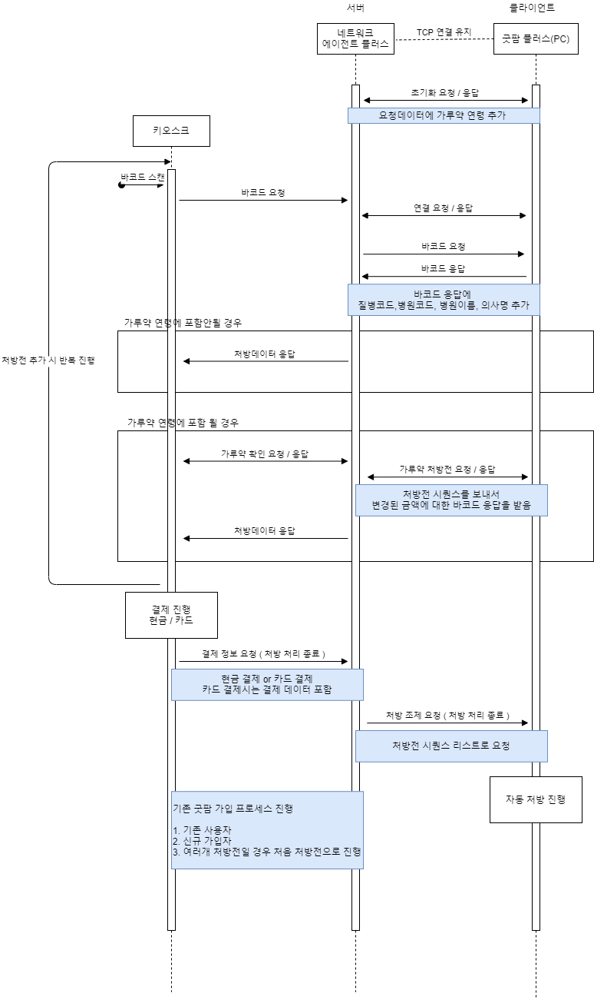

# 패킷 연동 문서
- 네트워크 에이전트와 굿팜 플러스의 패킷 플로우
- [시퀀스 다이어그램](https://lucid.app/lucidchart/da3ac51f-8575-4ffe-86ab-e806a84a0d62/view?page=7Hu1PC6.C7UI#)

  
## 패킷 형태
- 요청 패킷 : GPBEGIN;{Version};{protocol};{body};GPEND
- 응답 패킷 : GPBEGIN;{Version};{protocol};{ErrorCode};{ErrorMessage};{body};GPEND

## 버전 {Version}
- 1 사용

## 프로토콜 관련 {protocol}
- 01xxx 네트워크 에이전트 -> 굿팜 플러스
- 02xxx 굿팜 플러스 -> 네트워크 에이전트

## 프로토콜별 분류
### 초기화 패킷(000)
- 01000
    - 예시 : GPBEGIN;1;01000;;GPEND
- 02000 
    - GPBEGIN;1;02000;E000;;{가루약 최소 연령}|{가루약 최대 연령};GPEND
    - 패킷 : GPBEGIN;1;02000;E000;;6|12;GPEND

### 연결 패킷 ETC(100), OTC(110)
- 01100
    - 패킷 : GPBEGIN;1;01100;;GPEND
- 02100
    - 패킷 : GPBEGIN;1;02100;E000;;;GPEND
- 01110
    - 패킷 : GPBEGIN;1;01110;;GPEND
- 02110
    - 패킷 : GPBEGIN;1;02110;E000;;;GPEND

### 바코드(200)
- 01200
    - 패킷 : GPBEGIN;1;01200;{OTC바코드 또는 UB바코드 또는 EDB바코드};GBEND
    - 예시(UB바코드) : GPBEGIN;1;01200;UB<~8:n]qq)AB>0e@f=g\9nVU.0h1:V9dp[N7UR*.fK7pXDCR%A.OQ&q(^`s!I_#L)dm)K`VF7s'7@SqkNf7HBse+TR$+MpHWrq2%ZP4lBpsO&-AhhL-5)QRA<,CF=pMF_9GT2o1,%<Vk+T-$1aPn8m<Io+;S#'Xb$Aj;!celDs3'SEY3"&4KXd;Y'HDa>p141Dp<J9Y845W<b?6,cjmo&Vn\QWE\quVFl]ZA/(7H0PADdoldl@4m11_n#6?f>'*MgQbrWCD7*"+FRBEZsaNnV>=YbqPXs("11K<V#q>.,s&R:cM"Xh=:e+%R@,do?6hj?og7*7ig6hKQ]aA>;a:L].u-u4qqYfZOQL2)`d[db>>~>;GPEND
    - 예시(EDB바코드) : GPBEGIN;1;01200;http://www.edb.co.kr/m.htm?+MLK=9:S<^.;;-/-./)/.////..-,*,+//;쟨늑읜월;/-2*')2&),.;/-2*')2&),.;;쟨늑;읜삵;?.-,+;응잠옘;&,/+..-/.,/--.;.;;;;응잠옘;&,/+..-/.,/--;;;;/.;;;&&;//c)1.1.1,c;//ccccc;<]..)+)&//(./;??.??*;c,////;<]../*/.///./;??.??*;c,////;<Z;GPEND
- 02200
    - 예시 : GPBEGIN;1;02200;E000;;GPHD|20200904145612||테스터|19900101|M|202009041456|20200904|1|0|8270|5870|2400|2400|originCode‡HosCode‡HosName‡DiseaseCode‡0‡01012341234‡customerCode‡INS_PREP_PRICE‡INS_DRUG_PRICE‡NON_PREP_PRICE‡NON_DRUG_PRICE‡INCEN_DRUG_PRICE‡S_CODE1‡S_CODE2‡PGT_TYPE_YN‡Y‡2021040200001‡5‡1‡0‡|GPEND|SUBST|1|643900680|셉트린정_(1정)|1|3|1|SUBEND;GPEND Body 구성 : {기존처방전 응답구성}|{처방전문 추가 구성} 추가구성 정보 : {요양기관번호}‡{병원코드}‡{병원이름}‡{질병코드}‡{가루약 구분여부}‡{저장된 전화번호}‡{약국로컬고객번호}‡{급여조제료}‡{급여약가}‡{비급여조제료}‡{비급여약가}‡{저가대체 인센티브 약가}‡{특정기호1}‡{특정기호2}‡{임부확인}‡{신규여부}‡{교부번호}‡{처방전구분(종별)}‡{공상등구분}‡{의료급여종별구분}

### 처방전 조제 - 약사 PC에서 접수되거나 현금 승인된 ETC 처방전을 선택하였을 경우 (210)
- 01210
    - 패킷 : GPBEGIN;1;01210;{drugSeq};GPEND
    - 예시 : GPBEGIN;1;01210;220204858;GPEND
- 02210
    - 예시 : - 예시 : GPBEGIN;1;02200;E000;;GPHD|20200904145612||테스터|19900101|M|202009041456|20200904|1|0|8270|5870|2400|2400|originCode‡HosCode‡HosName‡DiseaseCode‡0‡01012341234‡customerCode‡INS_PREP_PRICE‡INS_DRUG_PRICE‡NON_PREP_PRICE‡NON_DRUG_PRICE‡INCEN_DRUG_PRICE‡S_CODE1‡S_CODE2‡PGT_TYPE_YN‡Y‡2021040200001‡5‡1‡0‡|GPEND|SUBST|1|643900680|셉트린정_(1정)|1|3|1|SUBEND;GPEND Body 구성 : {기존처방전 응답구성}|{처방전문 추가 구성} 추가구성 정보 : {요양기관번호}‡{병원코드}‡{병원이름}‡{질병코드}‡{가루약 구분여부}‡{저장된 전화번호}‡{약국로컬고객번호}‡{급여조제료}‡{급여약가}‡{비급여조제료}‡{비급여약가}‡{저가대체 인센티브 약가}‡{특정기호1}‡{특정기호2}‡{임부확인}‡{신규여부}‡{교부번호}‡{처방전구분(종별)}‡{공상등구분}‡{의료급여종별구분}

### 가루약 처방(300)
- 01300
    - 패킷 : GPBEGIN;1;01300;{DrugSeq};GPEND
    - 예시 : GPBEGIN;1;01300;20200904162851;GPEND
- 02300
    - 패킷 : GPBEGIN;1;02300;E000;;{DrugSeq}{비급여약가}|{총약제비}|{청구액}|{본인부담금}|{입금액};GPEND
    - 예시 : GPBEGIN;1;02300;E000;;20200904162851|0|9000|6000|2500|2500;GPEND
 
### 처방 조제 취소(800)
- 01800
    - 패킷 : GPBEGIN;1;01800;{DrugSeq리스트(,)구분자};GPEND
    - 예시 : GPBEGIN;1;01800;20200904162851,20200904162852;GPEND
- 02800
    - 패킷 : GPBEGIN;1;02800;E000;;;GPEND
    
### 결제요청{900(카드), 901(현금)} 결제 응답(900)
- 01900 
    - 패킷 : GPBEGIN;1;01900;{DrugSeq리스트(,)구분자}|{총 결제금액}|{봉투값}|{결제한카드번호}‡{결제한카드사}‡{총결제금액}‡{부가세}‡{봉사료}‡{할부}‡{응답코드}‡{응답사유}‡{승인번호}‡{승인일시}‡{매입사코드}‡{가맹점번호}‡{매입사명};GPEND
    - 예시 : GPBEGIN;1;01900;20200918140628|2400|50|438265‡현대비자개인‡2450‡223‡0‡00‡0000‡‡99140641‡200918140642‡027‡105011451‡현대카드사;GPEND
- 01901
    - 패킷 : GPBEGIN;1;01900;{DrugSeq리스트(,)구분자}|{총 결제금액};GPEND
    - 예시 : GPBEGIN;1;01900;20200918140628|2400;GPEND
- 02900
    - 패킷 : GPBEGIN;1;02900;E000;;;GPEND
    
### 약국 사용자 전화번호 업데이트(010)
- 01010
    - 패킷 : GPBEGIN;1;01010;20200904154423|01012341234;GPEND 
    - 예시 : GPBEGIN;1;01010;{DrugSeq}|{전화번호};GPEND 
- 02010
    - 패킷 : GPBEGIN;1;02010;E000;;;GPEND
  